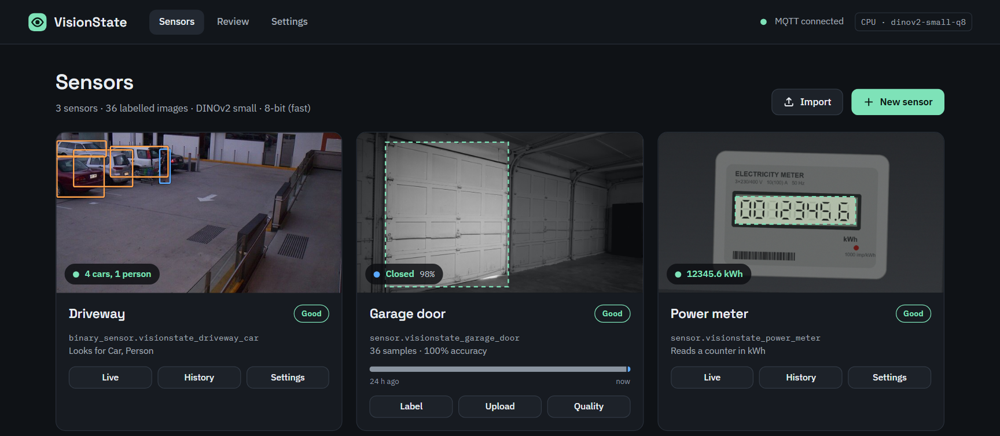
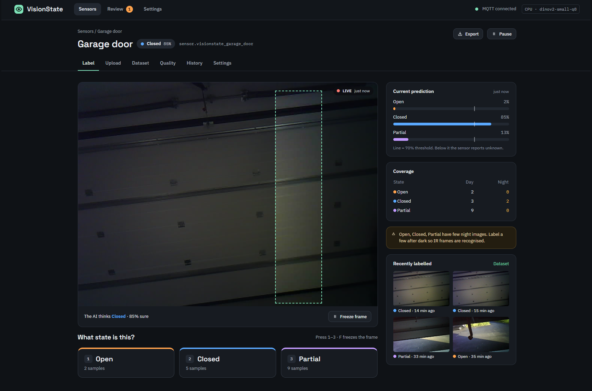
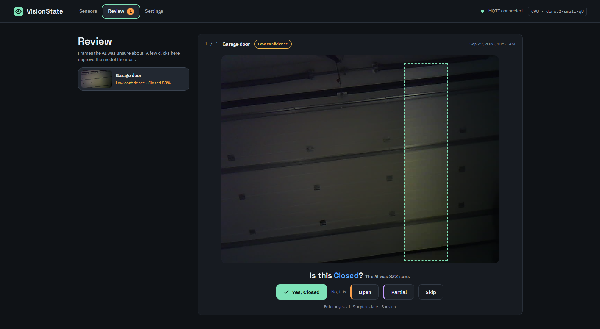

<p align="center">
  <picture>
    <source media="(prefers-color-scheme: dark)" srcset="docs/promo/logo-dark.png">
    
  </picture>
</p>

<p align="center">
  <b>Teach a local AI what your camera sees — and turn it into a Home Assistant sensor.</b><br>
  Garage door open, closed or halfway? Gate shut? Car in the driveway? Click a few examples and you have a sensor.
</p>

<p align="center">
  <a href="https://github.com/oleost/VisionState/actions/workflows/ci.yml"></a>
  
  
  
  <a href="LICENSE"></a>
</p>

<p align="center">
  <a href="https://my.home-assistant.io/redirect/supervisor_add_addon_repository/?repository_url=https%3A%2F%2Fgithub.com%2Foleost%2FVisionState">
    
  </a>
</p>

<p align="center">
  
</p>

## Why VisionState?

Your cameras already see whether *the garage door is half open*, *the gate is shut* or *the
lights in the shed are still on*. VisionState turns what they see into **states** you can use in
Home Assistant — and because every home is different, you teach it yourself, in minutes,
without writing code or leaving Home Assistant:

- 📸 **Train by clicking** — look at the live image and press the matching state (or keys `1`–`9`).
  The model retrains in about a second after every click.
- 🎯 **Watch only what matters** — draw a box around the door; the AI ignores everything else.
- 📦 **Bulk upload** — drop images, ZIP archives or a **video**; frames are extracted, duplicates
  skipped, and the current model suggests a label for each one.
- ⚡ **Smart triggers** — check when a motion sensor, door contact or the garage opener changes,
  or when the image itself changes. No more polling every few seconds.
- 🔁 **Gets better as you use it** — a review queue collects the frames the AI was unsure about;
  one click turns them into training data.
- 🧠 **Runs locally on any CPU** — Intel, AMD and Raspberry Pi 4/5. No cloud, no GPU, no subscription.
- 🏠 **Native Home Assistant** — sidebar app with Ingress; sensors appear through MQTT discovery.
- 🎥 **Any camera** — every `camera.*` entity in Home Assistant (ESP32-CAM, IP cameras, NVRs…),
  or a direct RTSP / HTTP snapshot URL.

## A look inside

<table>
  <tr>
    <td width="50%"></td>
    <td width="50%"></td>
  </tr>
  <tr>
    <td><b>Label</b> — live camera image with the region you drew, the current prediction, day/night coverage and one button per state.</td>
    <td><b>Review</b> — frames the AI was unsure about. Confirm or correct with a single key press.</td>
  </tr>
</table>

## Install

**Requirements:** Home Assistant OS or Supervised, the **Mosquitto broker** app and the
**MQTT** integration, and at least one camera.

1. Click **Add repository** above — or go to **Settings → Apps** (called *Add-ons* in older
   versions) **→ App store → ⋮ → Repositories** and add `https://github.com/oleost/VisionState`.
2. Install **VisionState**. The first install builds the app on your machine and takes 5–15
   minutes (longer on a Raspberry Pi).
3. Start it and open **VisionState** from the sidebar.

## Get your first sensor in five minutes

1. **New sensor** → name it, pick a camera.
2. Draw a box around the thing to watch.
3. Name the states, e.g. *Open*, *Closed*, *Partial*.
4. On the **Label** tab, press the matching state a few times for each situation — about
   **20 per state**, including some at night.
5. Under **Settings → When to check**, add your motion sensor or garage opener as a trigger.

That's it — `sensor.visionstate_garage_door` is now in Home Assistant:

| Entity | What it is |
|---|---|
| `sensor.visionstate_<name>` | The state (`open`, `closed`, …) — or `unknown` when the AI isn't sure |
| `sensor.visionstate_<name>_confidence` | How sure the AI is, in % |
| `image.visionstate_<name>_frame` | The region that was classified |
| `button.visionstate_<name>_classify` | Check right now (handy in automations) |
| `switch.visionstate_<name>_enabled` | Pause / resume |

```yaml
# Example: notify when the garage door has been open for 10 minutes
alias: Garage door left open
triggers:
  - trigger: state
    entity_id: sensor.visionstate_garage_door
    to: open
    for: "00:10:00"
actions:
  - action: notify.mobile_app_phone
    data:
      message: The garage door has been open for 10 minutes.
```

The full user guide is in [`visionstate/DOCS.md`](visionstate/DOCS.md) (also on the app's
*Documentation* tab).

## How it works

```
camera ─► crop to your region ─► DINOv2 (ONNX, 8-bit) ─► feature vector ─► tiny per-sensor classifier
                                                                                     │
Home Assistant ◄── MQTT discovery ◄── debounce + "unknown" below threshold ◄─────────┘
```

A pre-trained vision model ([DINOv2](https://github.com/facebookresearch/dinov2)) turns the
region into a feature vector. On top of that, each sensor gets its own small classifier trained
on *your* labelled images — which is why a handful of examples is enough and training takes
about a second. Results are debounced so someone walking past doesn't flip the state.

Everything stays on your machine: images live in `/media/visionstate`, models and settings in
the app's data folder (included in Home Assistant backups).

## Privacy & security

- 100 % local — no cloud services, no telemetry.
- Only reachable through Home Assistant Ingress (requires a Home Assistant login).
- Camera passwords are hidden in logs and removed from exported sensor bundles.

## Development

```
visionstate/            Home Assistant app (config.yaml, Dockerfile, docs)
  backend/              Python 3.12 · FastAPI · ONNX Runtime · scikit-learn
  frontend/             Svelte 5 · Vite · TypeScript
docs/SCOPE.md           Scope, design decisions and roadmap
```

<details>
<summary>Run it locally</summary>

Backend:

```bash
cd visionstate/backend
python -m venv .venv && . .venv/bin/activate      # Windows: .venv\Scripts\activate
pip install -r requirements-dev.txt
python -m visionstate.backbones models            # download the bundled model once
pytest
VISIONSTATE_DATA=./dev/data VISIONSTATE_MEDIA=./dev/media VISIONSTATE_BUNDLED_MODELS=./models \
  HA_URL=http://homeassistant.local:8123 HA_TOKEN=<long-lived token> \
  VISIONSTATE_MQTT_HOST=<broker> python -m visionstate
```

> ⚠️ Outside Home Assistant the app has **no login**: anyone who can reach port 8099 can use it.
> Only run it like this on your own machine or behind a reverse proxy with authentication.

Frontend (proxies `/api` to the backend on port 8099):

```bash
cd visionstate/frontend
npm install
npm run dev
```

</details>

Issues and ideas are welcome in [GitHub Issues](https://github.com/oleost/VisionState/issues).

## Licence

[Apache-2.0](LICENSE). The DINOv2 model weights are released by Meta under Apache-2.0.
