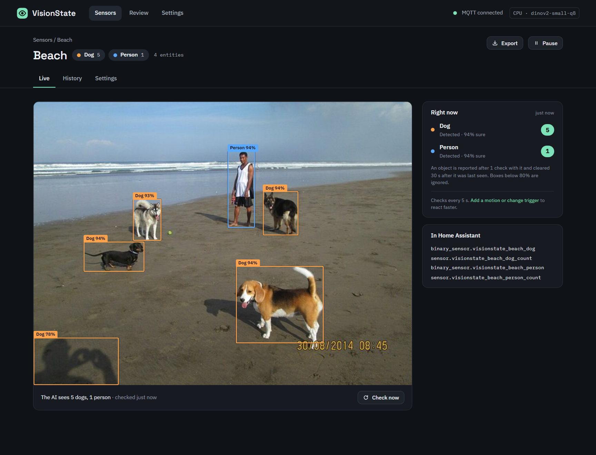
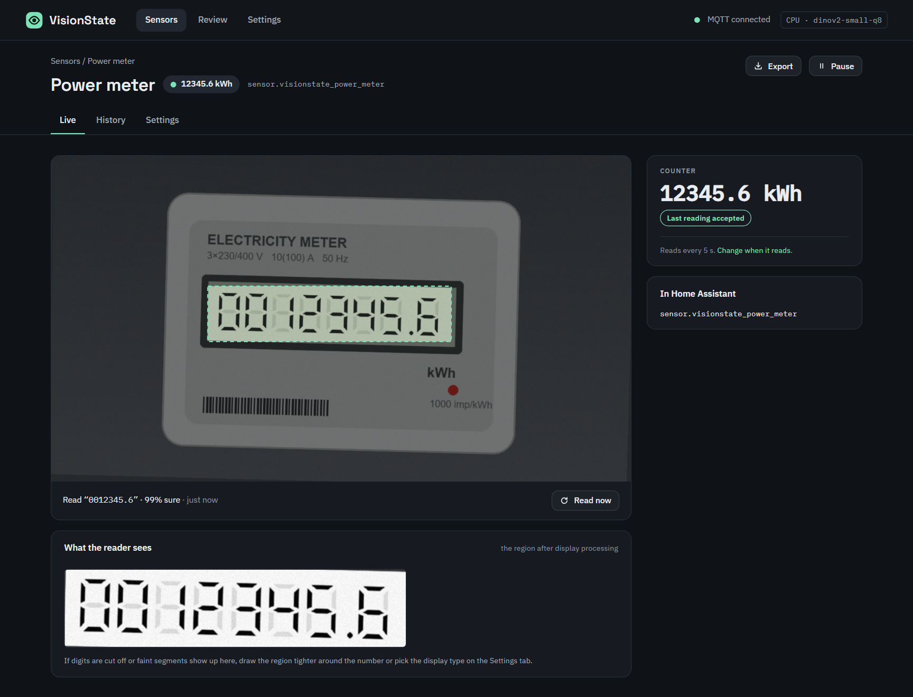
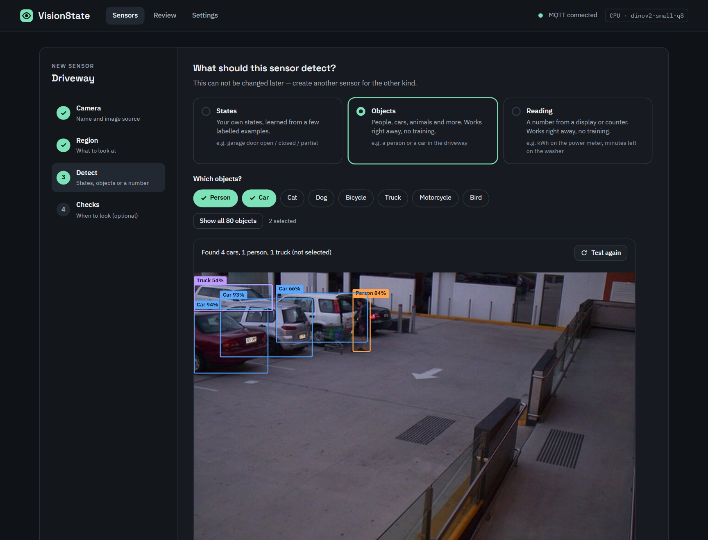
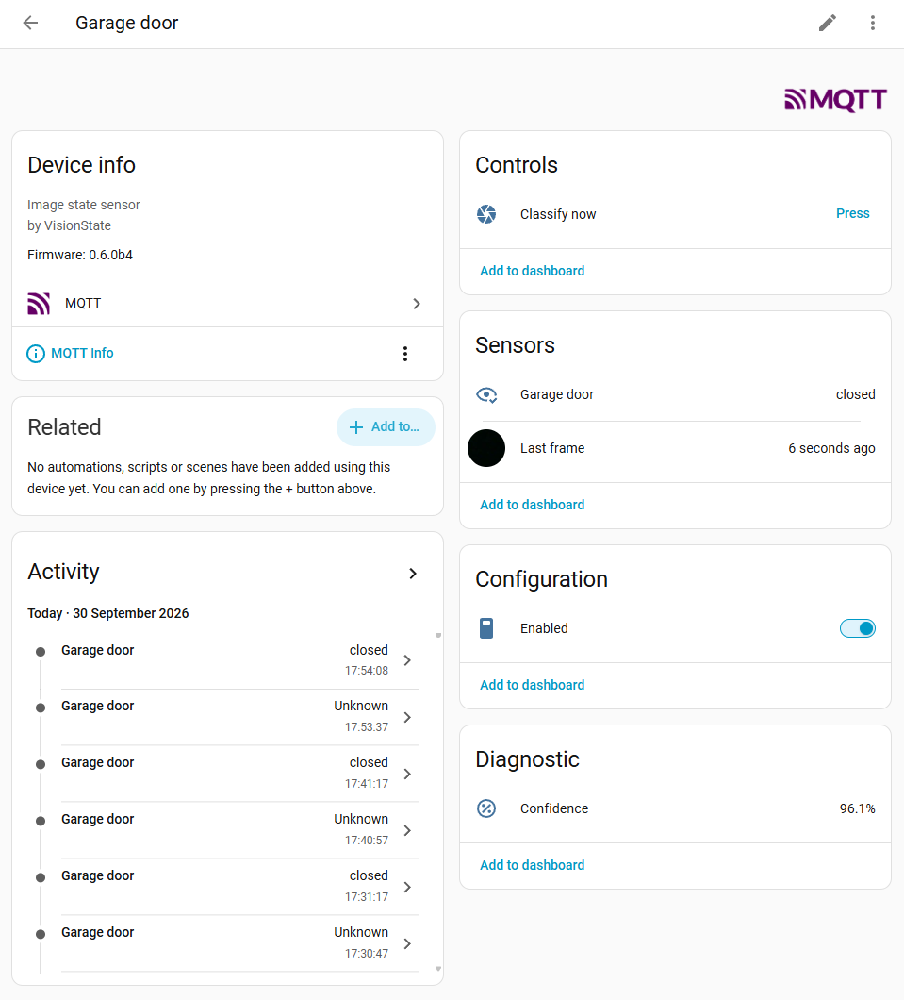
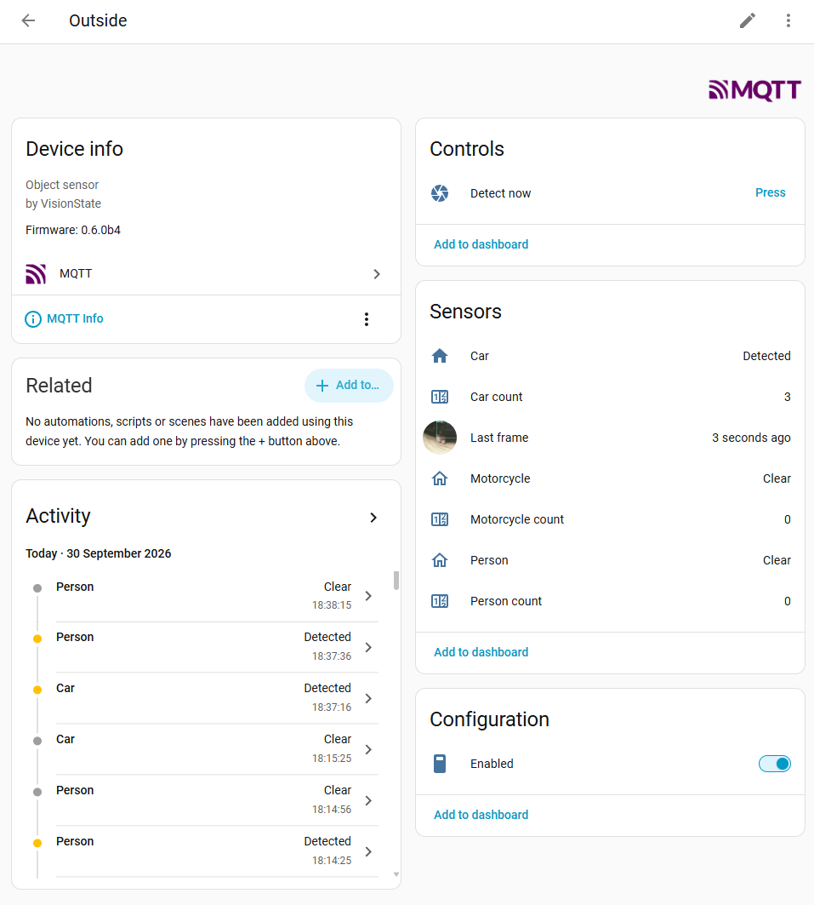

<p align="center">
  <picture>
    <source media="(prefers-color-scheme: dark)" srcset="docs/promo/logo-dark.png">
    
  </picture>
</p>

<p align="center">
  <b>Teach a local AI what your camera sees — and turn it into a Home Assistant sensor.</b><br>
  Garage door open, closed or halfway? Gate shut? Click a few examples and you have a sensor.<br>
  Person at the door, car in the driveway, cat on the lawn? Pick the objects — no training needed.<br>
  kWh on the meter, minutes left on the washer? Read the number.
</p>

<p align="center">
  <a href="https://github.com/oleost/VisionState/actions/workflows/ci.yml"></a>
  
  
  
  <a href="LICENSE"></a>
  <a href="https://buymeacoffee.com/o1ep"></a>
</p>

<p align="center">
  <a href="https://my.home-assistant.io/redirect/supervisor_add_addon_repository/?repository_url=https%3A%2F%2Fgithub.com%2Foleost%2FVisionState">
    
  </a>
</p>

<p align="center">
  
</p>

## Why VisionState?

Your cameras already see whether *the garage door is half open*, *the gate is shut* or *the
lights in the shed are still on*. VisionState turns what they see into **states** you can use in
Home Assistant — and because every home is different, you teach it yourself, in minutes,
without writing code or leaving Home Assistant:

- 📸 **Train by clicking** — look at the live image and press the matching state (or keys `1`–`9`).
  The model retrains in about a second after every click.
- 🐕 **Find objects without training** — people, cars, bicycles, cats, dogs and 75 more, with a
  count and an on/off sensor for each. Pick them, done.
- 🔢 **Read numbers** — power meters, the rolling digits of water and gas meters, prices, the
  minutes left on the washing machine. Counters
  only go up and land straight in the Energy dashboard; implausible readings are rejected.
- 🎯 **Watch only what matters** — draw a box (or any shape) around the door or the driveway;
  the AI ignores everything else.
- 📦 **Bulk upload** — drop images, ZIP archives or a **video**; frames are extracted, duplicates
  skipped, and the current model suggests a label for each one.
- ⚡ **Smart triggers** — check when a motion sensor, door contact or the garage opener changes,
  or when the image itself changes. No more polling every few seconds.
- 🩺 **Finds its own mistakes** — flags training images whose label looks wrong, so one slip
  doesn't drag the sensor down.
- 🔁 **Gets better as you use it** — a review queue collects the frames the AI was unsure about;
  one click turns them into training data.
- 🧠 **Runs locally on any CPU** — Intel, AMD and Raspberry Pi 4/5. No cloud, no GPU, no subscription.
- 🏠 **Native Home Assistant** — sidebar app with Ingress; sensors appear through MQTT discovery.
- 🎥 **Any camera** — every `camera.*` entity in Home Assistant (ESP32-CAM, IP cameras, NVRs…),
  or a direct RTSP / HTTP snapshot URL.

## A look inside

<table>
  <tr>
    <td width="50%" valign="top"></td>
    <td width="50%" valign="top"></td>
  </tr>
  <tr>
    <td valign="top"><b>Objects</b> — people, cars, animals and more, found without any training. Each one becomes an on/off sensor and a count in Home Assistant.</td>
    <td valign="top"><b>Reading</b> — the number on a display or on the rolling wheels of a water or gas meter, checked before it is published: a counter never goes down.</td>
  </tr>
  <tr>
    <td colspan="2" valign="top"></td>
  </tr>
  <tr>
    <td colspan="2" valign="top"><b>New sensor</b> — pick a camera, draw the region and choose what to detect: your own states, objects or a number. The wizard tests it on a fresh frame right away.</td>
  </tr>
</table>

## In Home Assistant

Every sensor is a normal Home Assistant device, set up automatically through MQTT discovery —
ready for dashboards, automations and the history graph.

<table>
  <tr>
    <td width="50%" valign="top"></td>
    <td width="50%" valign="top"></td>
  </tr>
  <tr>
    <td valign="top"><b>State sensor</b> — the state (<code>closed</code>, <code>open</code>, …) with its confidence, the last frame, a button to check now and a switch to pause it.</td>
    <td valign="top"><b>Object sensor</b> — an on/off sensor and a count for every object you picked, plus the last frame with the boxes drawn in.</td>
  </tr>
</table>

## Install

**Requirements:** Home Assistant OS or Supervised, the **Mosquitto broker** app and the
**MQTT** integration, and at least one camera.

1. Click **Add repository** above — or go to **Settings → Apps** (called *Add-ons* in older
   versions) **→ App store → ⋮ → Repositories** and add `https://github.com/oleost/VisionState`.
2. Install **VisionState** (it downloads a ready-made image for your machine).
3. Start it and open **VisionState** from the sidebar.

### Beta channel

New features are released as **beta** first and move to the stable app once they are tested. To
help test them, add `https://github.com/oleost/VisionState#beta` as a repository and install
**VisionState (beta)**.

- The beta is a separate app with its own data; move sensors over with **Export** (stable) and
  **Import** (beta). Entity ids stay the same, so automations keep working.
- Run only one of the two apps at a time — both publish the same sensors.

## Get your first sensor in five minutes

1. **New sensor** → name it, pick a camera.
2. Draw a box around the thing to watch (drag its corners to shape it to the object).
3. Name the states, e.g. *Open*, *Closed*, *Partial*.
4. On the **Label** tab, press the matching state a few times for each situation — about
   **20 per state**, including some at night.
5. Under **Settings → When to check**, add your motion sensor or garage opener as a trigger.

That's it — `sensor.garage_door` is now in Home Assistant:

| Entity | What it is |
|---|---|
| `sensor.<name>` | The state (`open`, `closed`, …) — or `unknown` when the AI isn't sure |
| `sensor.<name>_confidence` | How sure the AI is, in % |
| `image.<name>_last_frame` | The region that was classified |
| `button.<name>_classify_now` | Check right now (handy in automations) |
| `switch.<name>_enabled` | Pause / resume |
| `sensor.visionstate_review_queue` | Frames waiting for review (all sensors) |

```yaml
# Example: notify when the garage door has been open for 10 minutes
alias: Garage door left open
triggers:
  - trigger: state
    entity_id: sensor.garage_door
    to: open
    for: "00:10:00"
actions:
  - action: notify.mobile_app_phone
    data:
      message: The garage door has been open for 10 minutes.
```

The full user guide is in [`visionstate/DOCS.md`](visionstate/DOCS.md) (also on the app's
*Documentation* tab).

## How it works

```
camera ─► crop to your region ─► DINOv2 (ONNX, 8-bit) ─► feature vector ─► tiny per-sensor classifier
                                                                                     │
Home Assistant ◄── MQTT discovery ◄── debounce + "unknown" below threshold ◄─────────┘
```

A pre-trained vision model ([DINOv2](https://github.com/facebookresearch/dinov2)) turns the
region into a feature vector. On top of that, each sensor gets its own small classifier trained
on *your* labelled images — which is why a handful of examples is enough and training takes
about a second. Results are debounced so someone walking past doesn't flip the state.

Object sensors use a pretrained detector instead ([D-FINE](https://github.com/Peterande/D-FINE),
Apache-2.0, trained on the COCO objects). It finds every object in the region; each object you
picked is reported with a count and cleared a while after it was last seen.

Reading sensors read the digits in the region with a small text recognizer
([PaddleOCR](https://github.com/PaddlePaddle/PaddleOCR), Apache-2.0) that may only output digits,
then check the value (a counter never goes down) before publishing it.

Everything stays on your machine: images live in `/media/visionstate`, models and settings in
the app's data folder (included in Home Assistant backups).

## Privacy & security

- 100 % local — no cloud services, no telemetry.
- Only reachable through Home Assistant Ingress (requires a Home Assistant login).
- Camera passwords are hidden in logs and removed from exported sensor bundles.

## Development

```
visionstate/            Home Assistant app (config.yaml, Dockerfile, docs)
  backend/              Python 3.14 · FastAPI · ONNX Runtime · scikit-learn
  frontend/             Svelte 5 · Vite · TypeScript
scripts/channel.py      Switches the app config between the stable and beta channel
scripts/fake_camera.py  A fake camera (garage door, real photos, drawn displays and counters) for local testing
docs/SCOPE.md           Design as built, decisions and roadmap
CLAUDE.md               Contributor guide: conventions, how to test and verify, release steps
```

New features land on the `beta` branch first and reach `main` (stable) only after testing;
please open pull requests against `beta`. [`CLAUDE.md`](CLAUDE.md) explains the conventions, how to
test changes locally (fake camera, MQTT, UI tests on desktop and phone) and the pitfalls we ran
into — it is written for people and AI coding assistants alike.

<details>
<summary>Run it locally</summary>

Backend:

```bash
cd visionstate/backend
python3.14 -m venv .venv && . .venv/bin/activate  # Windows: py -3.14 -m venv .venv; .venv\Scripts\activate
pip install -r requirements-dev.txt
python -m visionstate.backbones models            # download the bundled model once
pytest
VISIONSTATE_DATA=./dev/data VISIONSTATE_MEDIA=./dev/media VISIONSTATE_BUNDLED_MODELS=./models \
  HA_URL=http://homeassistant.local:8123 HA_TOKEN=<long-lived token> \
  VISIONSTATE_MQTT_HOST=<broker> python -m visionstate
```

> ⚠️ Outside Home Assistant the app has **no login**: anyone who can reach port 8099 can use it.
> Only run it like this on your own machine or behind a reverse proxy with authentication.

Frontend (proxies `/api` to the backend on port 8099):

```bash
cd visionstate/frontend
npm install
npm run dev
```

UI tests (Playwright) start the backend and a fake camera by themselves and run every page on a
desktop browser and on an emulated phone with touch:

```bash
cd visionstate/frontend
npx playwright install chromium   # once
npm run build
VS_PYTHON=../backend/.venv/bin/python npm run e2e
```

</details>

Issues and ideas are welcome in [GitHub Issues](https://github.com/oleost/VisionState/issues).

## Licence

[Apache-2.0](LICENSE). The bundled models are Apache-2.0 as well: DINOv2 (Meta), D-FINE and
PaddleOCR PP-OCRv6.

If VisionState is useful to you, you can [buy me a coffee](https://buymeacoffee.com/o1ep) ☕
